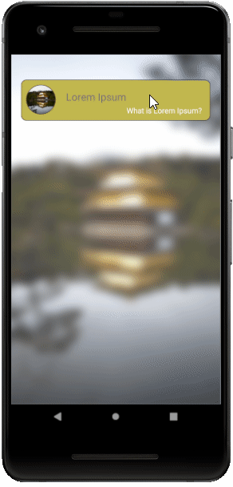
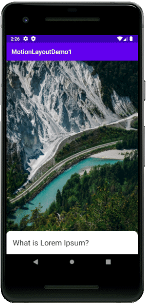
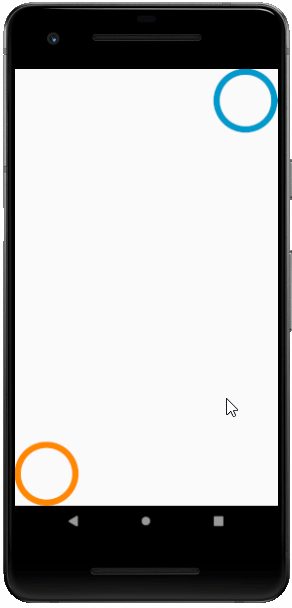
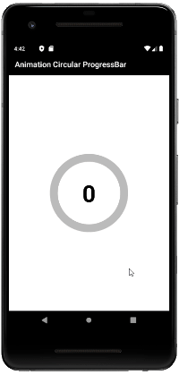
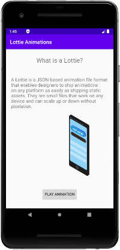
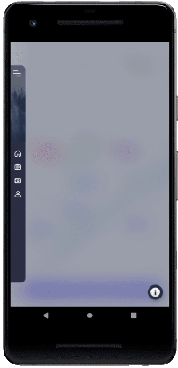

# Welcome to Android Animation
I'm going to share with you all the projects I'm learning about Android animation in this repository.

Sample projects:

[01 - Animation Simple](https://github.com/mahmood-ghaem/Android_Animation/tree/master/AnimationSimple)

I used 11 XML file to make animation.

[02 - Animation Drawable](https://github.com/mahmood-ghaem/Android_Animation/tree/master/AnimationDrawable)

I used 38 PNG file to make animation.

[03 - Animation Daimajia](https://github.com/mahmood-ghaem/Android_Animation/tree/master/AnimationDaimajia)

I used AnimationDaimajia libraryibrary to make animation.

[04 - Animation ConstraintSet Layout](https://github.com/mahmood-ghaem/Android_Animation/tree/master/AnimationConstraintSetLayout)

I used ConstraintSet and 2 XML file to make animation.

[05 - Animation ConstraintSet Code](https://github.com/mahmood-ghaem/Android_Animation/tree/master/AnimationConstraintSetCode)

I used ConstraintSet and made animation with code.

[06 - Animation MotionLayout](https://github.com/mahmood-ghaem/Android_Animation/tree/master/AnimationMotionLayout)

I read this at the following address and rewrote the code in Java

[Reference is here: CodeLabs](https://codelabs.developers.google.com/codelabs/motion-layout)

[07 - Make Scene Transition Animation](https://github.com/mahmood-ghaem/Android_Animation/tree/master/MakeSceneTransitionAnimation)

Another type of animation making in Android Studio.

[Reference is here: TVAC Studio](https://www.youtube.com/watch?v=BF4yvhpMPcg&list=PLUu5dK1pEfFexQlAskbONchfE55Wi0Sfp&index=1)

[08 - MotionLayout Demo 1](https://github.com/mahmood-ghaem/Android_Animation/tree/master/MotionLayoutDemo1)

Make Animation without code used MotionLayout.

[Reference is here: TVAC Studio](https://www.youtube.com/watch?v=T6029TkohgU)

[09 - MotionLayout Demo 2](https://github.com/mahmood-ghaem/Android_Animation/tree/master/MotionLayoutDemo2)

Make Animation without code used MotionLayout.

[Reference is here: Aaviskar Infotech](https://www.youtube.com/watch?v=O-1ou0SMhk8)

[10 - Animation Circular ProgressBar](https://github.com/mahmood-ghaem/Android_Animation/tree/master/AnimationCircularProgressBar)

Animated Number Counter with Circular ProgressBar by ValueAnimator in AndroidX | Property Animation.

[Reference is here: Aaviskar Infotech](https://www.youtube.com/watch?v=PJy0X1G2A4g)

[11 - Animation Big Picture](https://github.com/mahmood-ghaem/Android_Animation/tree/master/AnimationBigPicture)

Animation with Motion Editor using MotionLayout | Android Studio 4.0 | Scene of Scrolling Image.

[Reference is here: Aaviskar Infotech](https://www.youtube.com/watch?v=yenFqlAbDnE&list=PLqIYzEuLi9Crduj_euMrVp0z5K-Hyyhj5)

[12 - Lottie Animations](https://github.com/mahmood-ghaem/Android_Animation/tree/master/LottieAnimations)

Add Lottie Animations (Json Animation files) in Android and control in code.

[Read more about Lottie](https://lottiefiles.com/what-is-lottie)

[13 - MotionLayout Navigation Drawer](https://github.com/mahmood-ghaem/Android_Animation/tree/master/MotionLayoutNavDrawer)

Motion Layout
Make nice animation just in XML Layout without any Java or Kotlin code.
Use Transition: KeyFrameSet, KeyAttribute, KeyTrigger, KeyCycle, ...

[I used free Adobe XD resources UI Kits](https://www.adobe.com/products/xd/resources.html#panel-3)

