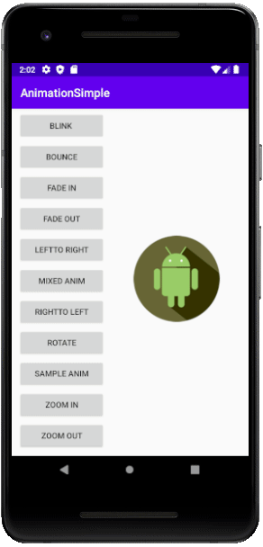
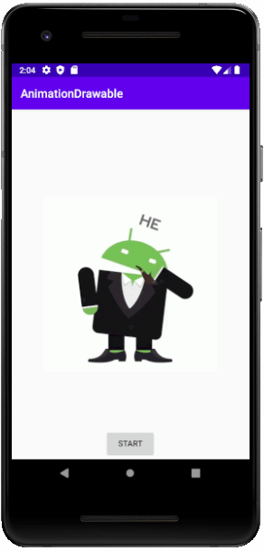
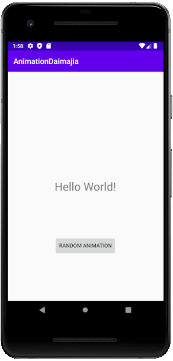
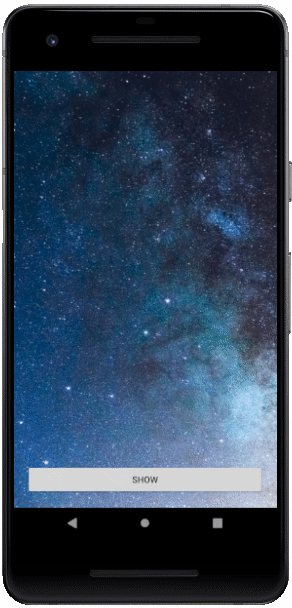
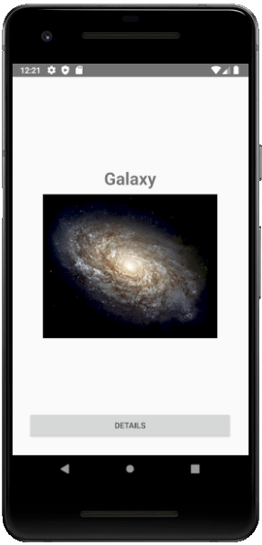

# Welcome to Android Animation
I'm going to share with you all the projects I'm learning about Android animation in this repository.

Sample projects:

[01 - Animation Simple](https://github.com/mahmood-ghaem/Android_Animation/tree/master/AnimationSimple)

I used 11 XML file to make animation.

[02 - Animation Drawable](https://github.com/mahmood-ghaem/Android_Animation/tree/master/AnimationDrawable)

I used 38 PNG file to make animation.

[03 - Animation Daimajia](https://github.com/mahmood-ghaem/Android_Animation/tree/master/AnimationDaimajia)

I used AnimationDaimajia libraryibrary to make animation.

[04 - Animation ConstraintSet Layout](https://github.com/mahmood-ghaem/Android_Animation/tree/master/AnimationConstraintSetLayout)

I used ConstraintSet and 2 XML file to make animation.

[05 - Animation ConstraintSet Code](https://github.com/mahmood-ghaem/Android_Animation/tree/master/AnimationConstraintSetCode)

I used ConstraintSet and made animation with code.

[06 - Animation MotionLayout](https://github.com/mahmood-ghaem/Android_Animation/tree/master/AnimationMotionLayout)

I read this at the following address and rewrote the code in Java

[Reference is here: CodeLabs](https://codelabs.developers.google.com/codelabs/motion-layout)

